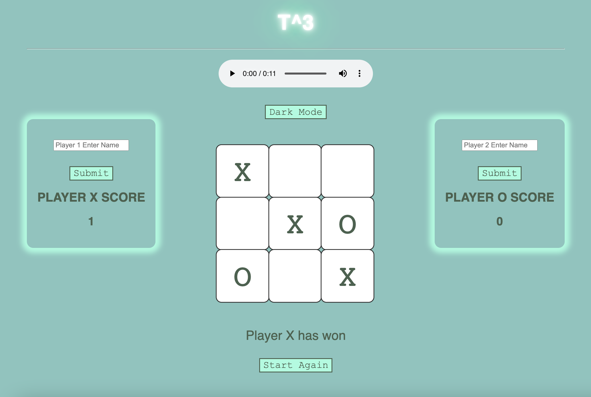

# Tic Tac Toe

A group mini-project to model the game Tic Tac Toe (aka Noughts & Crosses), using HTML, CSS, and JavaScript.

Our team consisted of BNTA Cohort 4 members: [Abdi](https://github.com/Abdiqaniafrah), [Aoife](https://github.com/aoifeags), [Marcy](https://github.com/mycp98), and [Rachel](https://github.com/RKaurB).

## Project outline

### MVP requirements were to:
* Have a recognisable layout
* Allow two players to take alternate turns
* Be able to identify which area of the grid a player wants to mark on their turn
* Determine a winner

### Extensions we implemented:
* To be able to restart the game without reloading the page
* To keep track of how many games each player has won
* Add sound to the game

### Future extensions to implement:
* Allow the player to enter their name instead of being "player 1" or "player 2"
* Have an alternative to Xs and Os on the board - e.g. players' names/shapes/some other theme?
* Abstract the game logic into a separate class and write unit tests for it
* Let a single player play against the computer (advanced extension)

## Set-up instructions

1. Clone this repository: ``git@github.com:aoifeags/tic-tac-toe-game.git`` and open with your favourite IDE (we recommend [Visual Studio Code](https://code.visualstudio.com/))
2. Open ``index.html`` in your preferred browser
3. Play!